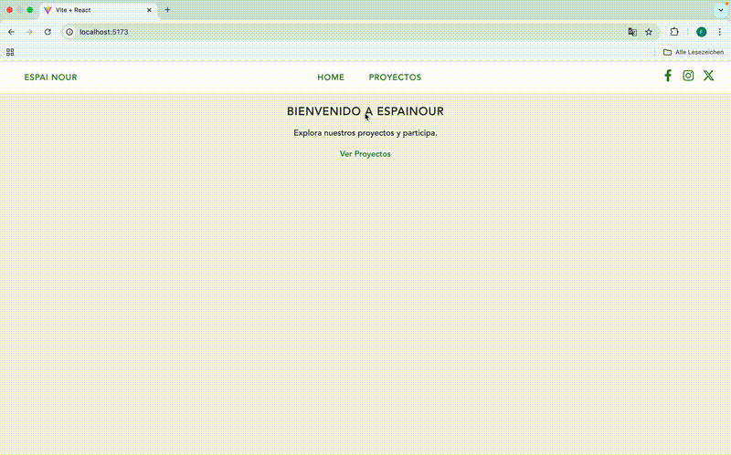

# EspaiNour / MyItems

Aplicación fullstack CRUD de proyectos con **Spring Boot** en el backend y **React / Vite** en el frontend. Permite crear, listar, buscar, ver, editar y eliminar proyectos con persistencia real en base de datos.

---

## 📌 Descripción del Proyecto

**Espai Nour Palestina – Associació d'Integració i Suport per a Refugiades i Refugiats** es una organización sin ánimo de lucro fundada para apoyar a personas refugiadas en su integración y bienestar en Cataluña.

Esta aplicación sirve como base técnica para una futura plataforma en línea, facilitando la gestión de proyectos:

- Información básica: `title`, `description`  
- Tags asociados  
- Fechas de creación (`createdAt`) y actualización (`updatedAt`)  
- Búsqueda por título y tags  
- Paginación de resultados  

Objetivo: demostrar dominio básico de **frontend + backend conectados** con CRUD completo, búsqueda, paginación y gestión de estados.

---

## 📁 Estructura del Proyecto

```bash
espainour/
├── README.md
├── backend/
│   ├── .mvn/wrapper
│   ├── docs
│   ├── src/
│   │   └── main/java/com/example/espainour/
│   │       ├── config/
│   │       ├── controller/
│   │       ├── dto/
│   │       ├── exception/
│   │       ├── model/
│   │       ├── repository/
│   │       ├── service/
│   │       └── DemoApplication.java
│   ├── .gitattributes
│   ├── .gitignore
│   ├── README.md
│   ├── mvnw
│   ├── mvnw.cmd
│   └── pom.xml
├── frontend/
│   ├── public/
│   ├── src/
│   │   ├── assets/
│   │   ├── components/
│   │   ├── pages/
│   │   ├── routes/
│   │   ├── App.css
│   │   ├── App.jsx
│   │   ├── index.css
│   │   └── main.jsx
│   ├── .gitignore
│   ├── README.md
│   ├── eslint.config.js
│   ├── index.html
│   ├── package-lock.json
│   ├── package.json
│   └── vite.config.js
```
---

## ⚙️ Backend (Spring Boot)

### Endpoints

| Método | Ruta | Descripción |
|--------|------|------------|
| GET | `/api/health` | Devuelve `{ "status": "ok", "version": "1.0.0" }` |
| GET | `/api/proyectos?search=&page=&pageSize=` | Listado de proyectos con búsqueda y paginación |
| POST | `/api/proyectos` | Crear un nuevo proyecto |
| GET | `/api/proyectos/:id` | Obtener detalle de proyecto |
| PUT | `/api/proyectos/:id` | Actualizar proyecto |
| DELETE | `/api/proyectos/:id` | Borrar proyecto |

### Ejemplo GET `/api/proyectos?search=Escuela&page=0&pageSize=10`

```json
{
  "data": [
    {
      "id": 1,
      "title": "Escuela",
      "description": "Construcción de escuela",
      "tags": ["educación"],
      "createdAt": "2025-09-23",
      "updatedAt": "2025-09-23"
    }
  ],
  "meta": {
    "page": 1,
    "pageSize": 10,
    "total": 1
  }
}
```

### Ejemplo POST `/api/proyectos`

```json
{
  "title": "Nuevo Proyecto",
  "description": "Descripción opcional",
  "tags": ["infraestructura", "educación"]
}
```

### Instrucciones Backend

1. Copiar `.env.example` a `.env` y configurar la base de datos  
2. Ejecutar migraciones si aplica  
3. Levantar servidor:

```bash
./mvnw spring-boot:run
```

4. Health check:

```bash
curl http://localhost:8080/api/health
```

---

## ⚛️ Frontend (React / Vite)

### Funcionalidades

- Listado de proyectos con búsqueda y paginación  
- Formulario de crear / editar proyectos  
- Detalle de proyecto mostrando descripción, tags, `createdAt` y `updatedAt`  
- Añadir y eliminar tags dinámicamente  
- Botón “Probar conexión” (`/api/health`)  
- Estados de **loading** y manejo de **errores**  

### Estructura de rutas

| Ruta | Componente |
|------|------------|
| `/` | Home |
| `/proyectos` | Listado de proyectos |
| `/proyectos/new` | Crear proyecto |
| `/proyectos/:id/editar` | Editar proyecto |
| `/proyectos/:id` | Detalle de proyecto |

### Instrucciones Frontend

```bash
cd frontend
npm install
npm install react-icons
npm run dev
```

Acceder a la app en: [http://localhost:5173](http://localhost:5173)

---
### Ordenación y filtros avanzados

La aplicación permite ordenar y filtrar proyectos de manera avanzada:

#### Funcionalidades

- **Ordenación**
  - Parámetros: `sort=createdAt|title` y `dir=asc|desc`
  - Ejemplo: `/proyectos?sort=title&dir=asc`

- **Filtros por tags**
  - Parámetro: `tags=infraestructura,educación`
  - Múltiples tags separados por coma
  - Muestra solo proyectos que contienen todos los tags seleccionados

- **Búsqueda combinada**
  - Combina ordenación, filtros y búsqueda:  
    `/proyectos?sort=createdAt&dir=desc&tags=educación,infraestructura&search=Escuela`

#### Ejemplo de llamada API

```http
GET /api/proyectos?sort=title&dir=asc&tags=educación,infraestructura&page=0&pageSize=10

{
  "data": [
    {
      "id": 1,
      "title": "Construcción de escuela",
      "description": "Proyecto educativo",
      "tags": ["educación", "infraestructura"],
      "createdAt": "2025-09-23",
      "updatedAt": "2025-09-23"
    }
  ],
  "meta": { "page": 0, "pageSize": 10, "total": 1 }
}
```

#### Beneficios UX

- Permite encontrar proyectos relevantes rápidamente

- La URL refleja filtros y ordenación, facilitando compartir enlaces directos
---

## 🧪 Tests

- Backend: integración CRUD con **JUnit 5** y **MockMvc**  
- Frontend: probado manualmente lista, detalle, crear, editar y borrar  

---

## 🖼️ GIF de la App



---

## 📝 Notas Adicionales

- La búsqueda muestra un mensaje **“Buscando proyectos…”** mientras se cargan los resultados  
- La lista de proyectos permite navegar al detalle haciendo clic en cada proyecto  
- Paginación funcional con botones **Anterior / Siguiente**  
