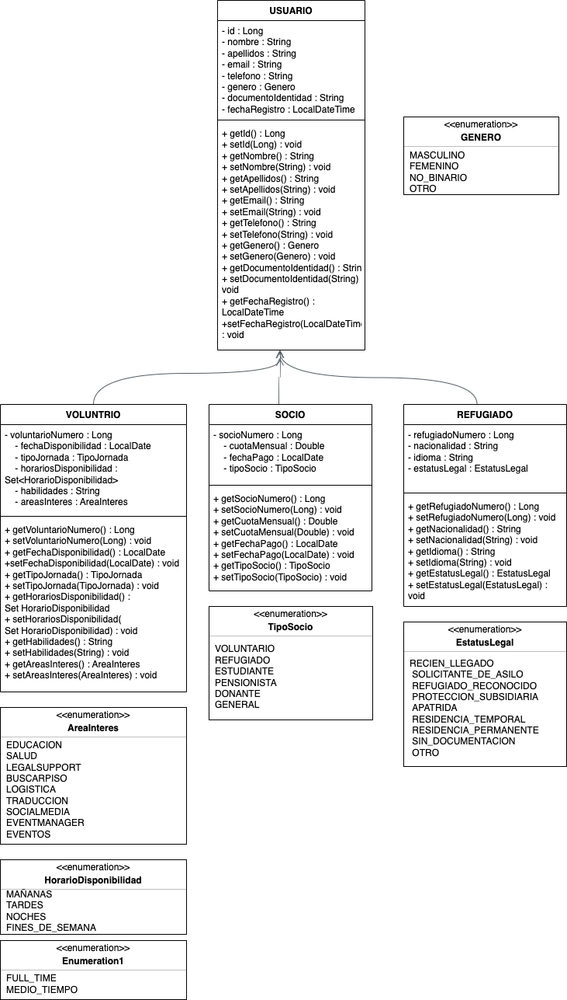

# 🌍 EspaiNour – API REST para Apoyo a Refugiados

## 📝 Descripción del Proyecto

**Espai Nour Palestina – Associació d'Integració i Suport per a Refugiades i Refugiats** es una organización sin ánimo de lucro recientemente fundada, con la misión de apoyar a personas refugiadas en su integración y bienestar en Cataluña.

Esta API REST en Java y Spring Boot sirve como base técnica para una futura plataforma en línea del proyecto. Su objetivo es facilitar la gestión de:

* 👥 **Voluntarios** – pueden registrarse para ofrecer ayuda.
* 🧕 **Refugiados** – pueden contactar con la asociación y recibir asistencia personalizada.
* 💬 **Socios** – pueden registrarse para apoyar el proyecto a largo plazo mediante donaciones o colaboración.

Además, la plataforma permitirá organizar **eventos benéficos** para:

* Recaudar fondos.
* Atraer a nuevos socios.
* Difundir el trabajo de la asociación.

También se busca fomentar el contacto entre voluntarios, socios y refugiados para crear una comunidad más cohesionada.

---

## 📚 Diagrama de Clases



El proyecto utiliza una estructura de herencia basada en una clase abstracta Usuario, que es extendida por Refugiado, Voluntario y Socio.
Se aplica la estrategia JOINED de JPA para la herencia, lo que garantiza una estructura clara y normalizada en la base de datos MySQL.

---

## ⚙️ Configuración

1. Clona el repositorio:

   
```bash
git clone https://github.com/ZiskaS/ProjectM2.git
cd ProjectM2
```


2. Crea la base de datos en MySQL:

   
```sql
   CREATE DATABASE espainour_db;
```

3. Configura application.properties:

```properties   
# Configuración de la conexión a la base de datos
spring.datasource.url=jdbc:mysql://localhost:3314/demo?createDatabaseIfNotExist=true
spring.datasource.username=root
spring.datasource.password=ironhack
spring.datasource.driver-class-name=com.mysql.cj.jdbc.Driver

# Configuración JPA/Hibernate
spring.jpa.hibernate.ddl-auto=update
spring.jpa.show-sql=true
```


4. Ejecuta la aplicación:

   
```bash
   ./mvnw spring-boot:run
```

---

## 💻 Tecnologías Usadas

* Java 17
* Spring Boot
* Spring Data JPA
* MySQL
* Maven
* Spring Security (opcional, JWT preparado)
* JUnit 5 & Mockito

---

## 🧭 Estructura de Rutas y Controladores

| Recurso        | Método | Ruta                    | Descripción                  |
| -------------- | ------ | ----------------------- | ---------------------------- |
| **Refugiado**  | GET    | /api/refugiados       | Lista de personas refugiadas |
|                | POST   | /api/refugiados       | Crear nuevo refugiado        |
|                | PUT    | /api/refugiados/{id}  | Actualizar refugiado         |
|                | PATCH  | /api/refugiados/{id}  | Actualización parcial        |
|                | DELETE | /api/refugiados/{id}  | Eliminar refugiado           |
| **Voluntario** | GET    | /api/voluntarios      | Lista de voluntarios         |
|                | POST   | /api/voluntarios      | Crear nuevo voluntario       |
|                | PUT    | /api/voluntarios/{id} | Actualizar voluntario        |
|                | PATCH  | /api/voluntarios/{id} | Actualización parcial        |
|                | DELETE | /api/voluntarios/{id} | Eliminar voluntario          |
| **Socio**      | GET    | /api/socios           | Lista de socios              |
|                | POST   | /api/socios           | Crear nuevo socio            |
|                | PUT    | /api/socios/{id}      | Actualizar socio             |
|                | PATCH  | /api/socios/{id}      | Actualización parcial        |
|                | DELETE | /api/socios/{id}      | Eliminar socio               |
| **Usuario**    | GET    | /api/usuarios         | Obtener todos los usuarios   |
|                | DELETE | /api/usuarios/{id}    | Eliminar usuario             |

---

## ✅ Pruebas

* Pruebas unitarias con JUnit 5 y Mockito.
* Pruebas de integración para verificar la conexión a la base de datos.
* Manejo de errores robusto con controladores personalizados (@ControllerAdvice).

---

## 🛡️ Autenticación (Opcional)

La autenticación con JWT y Spring Security está preparada y puede ser añadida fácilmente para proteger rutas específicas y habilitar el acceso basado en roles (Admin, Voluntario, Refugiado, Socio).

---

## 🚀 Posibles Mejoras Futuras

* Registro de usuarios con roles diferenciados y login con JWT.
* Portal web con React para voluntarios, refugiados y socios.
* Incorporación del rol Donante, permitiendo realizar donaciones directamente desde la aplicación.
* Portal para socios con acceso a cuenta online personal, donde puedan gestionar sus datos y consultar un historial de sus actividades y colaboraciones.
* Envío de notificaciones por email.
* Integración con servicios externos para validación de identidad.

---

## 📎 Enlaces Útiles

* [Presentación del Proyecto (Google Slides)](https://docs.google.com/presentation/d/...)

---

## 👥 Equipo de Desarrollo

* Franziska Stude

---

## 📚 Recursos

* [Documentación de Spring Boot](https://spring.io/projects/spring-boot)
* [Guía de Herencia en JPA (Baeldung)](https://www.baeldung.com/jpa-inheritance)
* [Documentación MySQL](https://dev.mysql.com/doc/)
* [Postman – Herramienta para testing de APIs](https://www.postman.com/)


